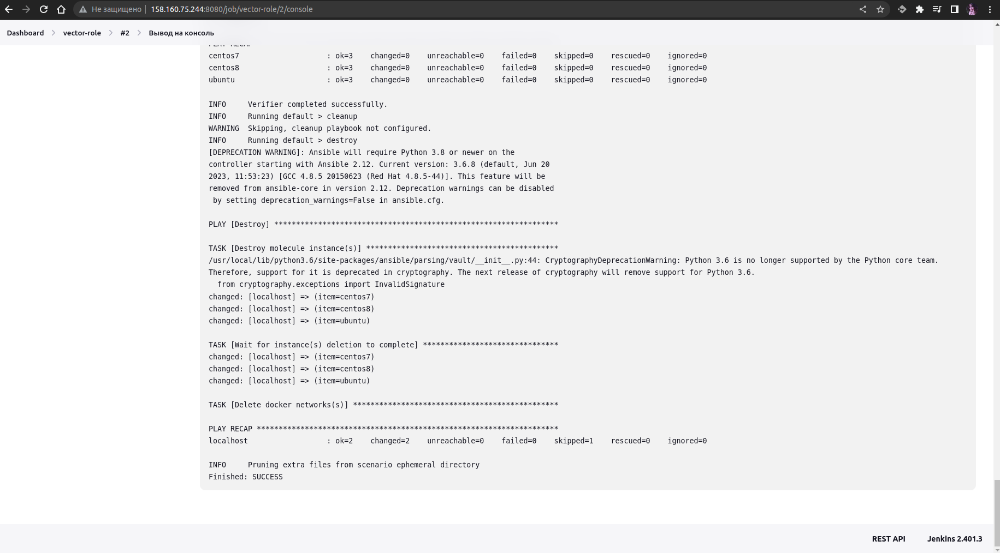
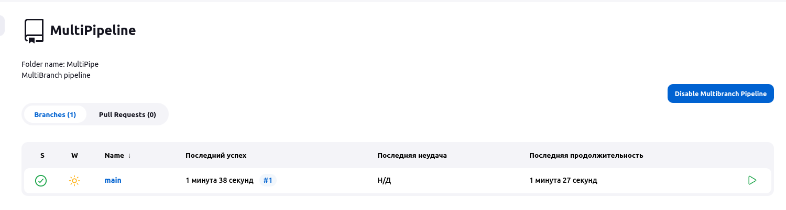

# Домашнее задание к занятию 10 «Jenkins»

## Основная часть

Сделать Freestyle Job, который будет запускать `molecule test` из любого вашего репозитория с ролью.

```
PLAY [Destroy] *****************************************************************

TASK [Destroy molecule instance(s)] ********************************************
/usr/local/lib/python3.6/site-packages/ansible/parsing/vault/__init__.py:44: CryptographyDeprecationWarning: Python 3.6 is no longer supported by the Python core team. Therefore, support for it is deprecated in cryptography. The next release of cryptography will remove support for Python 3.6.
  from cryptography.exceptions import InvalidSignature
changed: [localhost] => (item=centos7)
changed: [localhost] => (item=centos8)
changed: [localhost] => (item=ubuntu)

TASK [Wait for instance(s) deletion to complete] *******************************
changed: [localhost] => (item=centos7)
changed: [localhost] => (item=centos8)
changed: [localhost] => (item=ubuntu)

TASK [Delete docker networks(s)] ***********************************************

PLAY RECAP *********************************************************************
localhost                  : ok=2    changed=2    unreachable=0    failed=0    skipped=1    rescued=0    ignored=0

INFO     Pruning extra files from scenario ephemeral directory
Finished: SUCCESS
```




2. Сделать Declarative Pipeline Job, который будет запускать `molecule test` из любого вашего репозитория с ролью.
3. Перенести Declarative Pipeline в репозиторий в файл `Jenkinsfile`.

```groovy
pipeline {
    agent {
        label 'ansible'
    }
    stages {
        stage('First') {
            steps {
                sh 'molecule test'
            }
        }           
    }
}
```

```sh
PLAY RECAP *********************************************************************
localhost                  : ok=2    changed=2    unreachable=0    failed=0    skipped=1    rescued=0    ignored=0

INFO     Pruning extra files from scenario ephemeral directory
[Pipeline] }
[Pipeline] // stage
[Pipeline] }
[Pipeline] // withEnv
[Pipeline] }
[Pipeline] // node
[Pipeline] End of Pipeline
Finished: SUCCESS
```


Создать Multibranch Pipeline на запуск `Jenkinsfile` из репозитория.




Внести необходимые изменения:
```groovy
node("linux"){
    stage("Git checkout"){
        url: 'https://github.com/stadeof/ansible-roles-netology.git'
    }
    stage("Run playbook"){
        prod_run=false
        if (prod_run == false){
            sh 'git pull https://github.com/stadeof/ansible-roles-netology.git'
            sh 'ansible-galaxy install -r requirements.yml -p roles'
            sh 'ansible-playbook --check --diff site.yml -i inventory/prod.yml'
        }
        else{
            sh 'git pull https://github.com/stadeof/ansible-roles-netology.git'
            sh 'ansible-galaxy install -r requirements.yml -p roles'
            sh 'ansible-playbook site.yml -i inventory/prod.yml'
        }
        
    }
}
```

8. Отправить ссылку на репозиторий с ролью и Declarative Pipeline и Scripted Pipeline.
